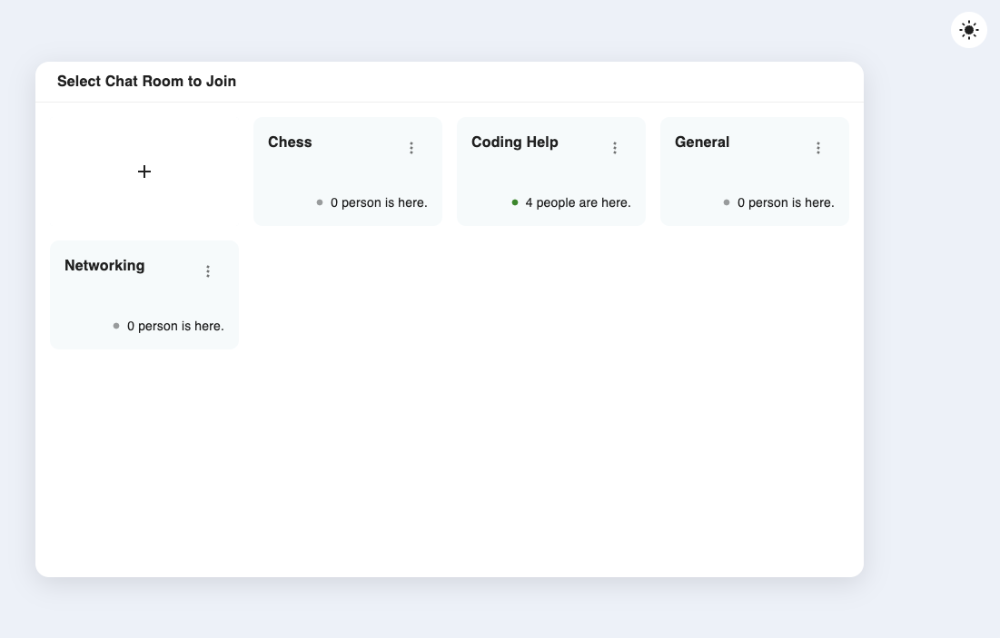
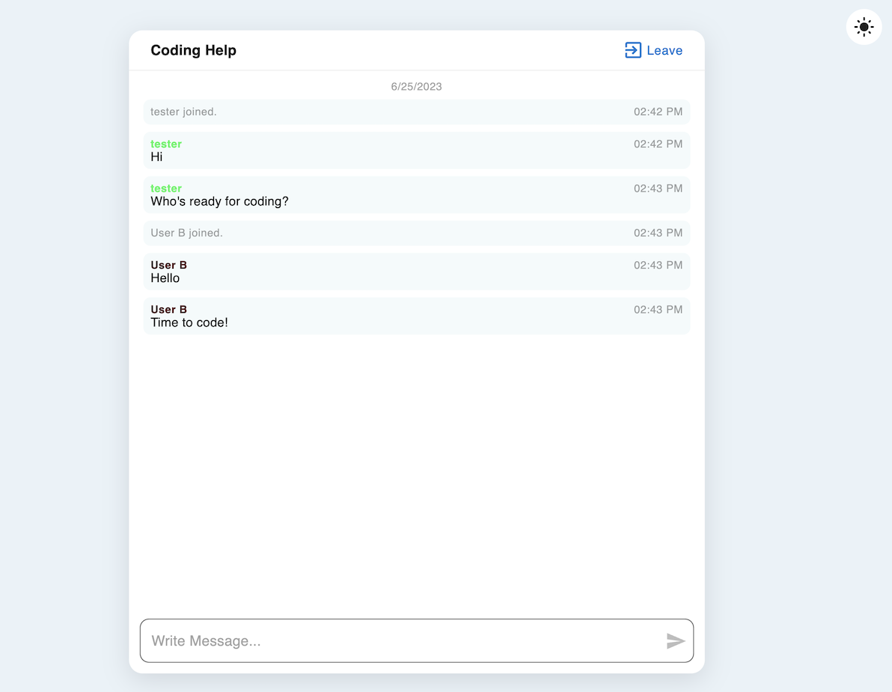

# Good Ol Chat Room

Online chat rooms can be really enjoyable. Nowadays, most of the popular communication apps are all about messaging, which is cool for staying in touch with familiar faces. But there's something serene about chat rooms. With this simple and minimalistic chat app, you don't need to bother creating a user account. Pick a name and dive into conversations!

## Tech Stacks

- Frontend – _React_ (+ _React Router_ + _Redux Toolkit_), _Material UI_, _Socket.IO Client_
- Backend – _Node.js_ + _Express.js_, _SQLite3_, _Socket.IO_

## Key Features

-  chat rooms by clicking a chat room card and entering a username.
- Up to 1000 messages are stored in memory on the server and displayed in each chat room.
- The number of people in each room is shown in each chat room card and kept updated.
-  chat rooms.
-  chat rooms. (The password set during the chat room creation process is required.)
